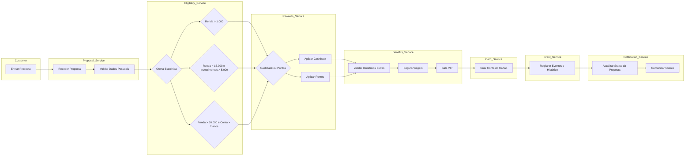
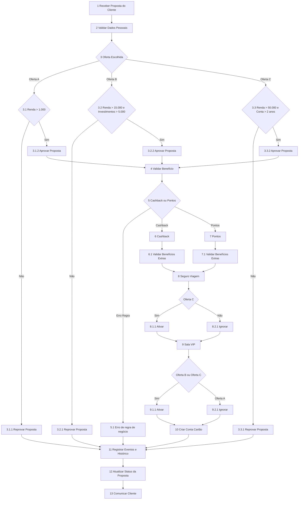

# Processamento de Proposta de Cartão

Este documento descreve o fluxo completo de processamento de uma proposta de cartão, incluindo validação de elegibilidade da oferta, seleção de recompensas, aplicação de benefícios e comunicação final com o cliente.

O objetivo desta documentação é facilitar o entendimento do processo por desenvolvedores, arquitetos de software e equipes de produto.

---

# Visão Geral do Processo

O fluxo de processamento da proposta segue as seguintes etapas:

1. Recebimento da proposta do cliente
2. Validação dos dados pessoais
3. Verificação de elegibilidade da oferta
4. Validação de benefícios disponíveis
5. Seleção do modelo de recompensa (cashback ou pontos)
6. Aplicação de benefícios extras
7. Criação da conta do cartão
8. Registro de eventos e histórico
9. Atualização do status da proposta
10. Comunicação com o cliente

---

# Regras de Elegibilidade das Ofertas

| Oferta | Regras |
|------|------|
Oferta A | Renda > R$ 1.000 |
Oferta B | Renda > R$ 15.000 **e** Investimentos > R$ 5.000 |
Oferta C | Renda > R$ 50.000 **e** Conta corrente > 2 anos |

---

# Benefícios por Oferta

| Benefício | Oferta A | Oferta B | Oferta C |
|------|------|------|------|
Cashback | ✔ | ✔ | ✔ |
Pontos | ✔ | ✔ | ✔ |
Seguro Viagem | ✖ | ✖ | ✔ |
Sala VIP | ✖ | ✔ | ✔ |

---

# Regras de Recompensa

O cliente pode escolher apenas **uma das opções abaixo**:

- Cashback
- Pontos

As opções são **mutuamente exclusivas**, ou seja, não é possível possuir cashback e pontos simultaneamente.

Caso seja selecionada uma opção inválida, o sistema deve registrar um erro de regra de negócio.

---

# Fluxo Arquitetural

Este diagrama representa como os serviços do sistema interagem durante o processamento da proposta.

---
# Fluxograma do Processo

---

# Eventos do Sistema

Durante o processamento da proposta, seria interessante colocar eventos para publicados em um sistema de mensageria como:

- RabbitMQ
- AWS SNS/SQS

---

# Objetivo da Documentação

Esta documentação tem como finalidade:

- Registrar as regras de negócio
- Descrever o fluxo de processamento da proposta
- Facilitar o entendimento da arquitetura do sistema
- Servir como referência para desenvolvedores e arquitetos envolvidos no projeto

---

# Diagrama no Figma

O fluxo completo também está disponível no Figma.

Clique para abrir o board:

[Visualizar no Figma](https://www.figma.com/board/Yp2tHEiu2sGynZSZ90qoI9/Sem-t%C3%ADtulo?node-id=0-1&t=YqZqsrqs3NWBpf5l-1)
